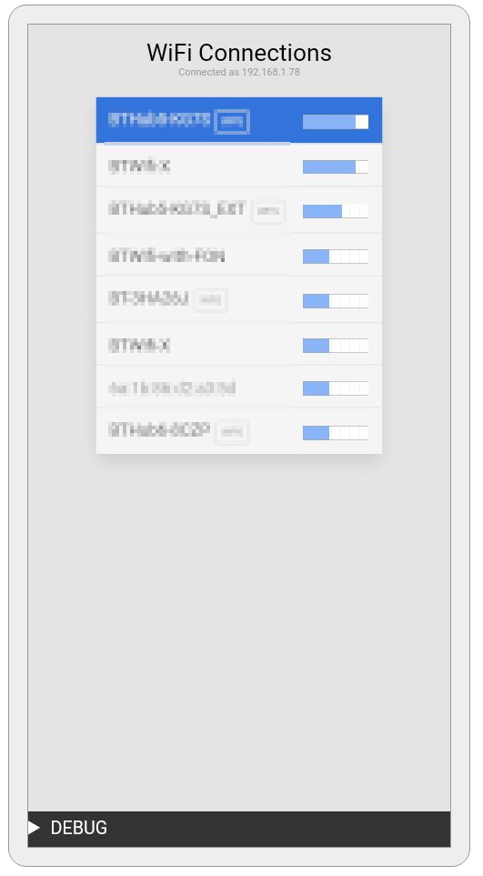
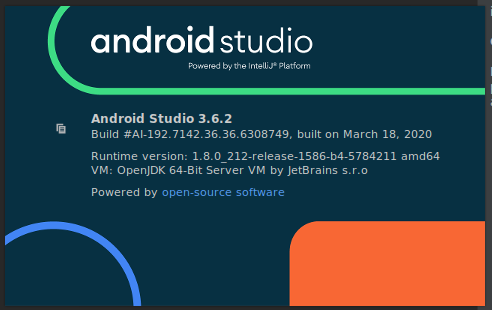
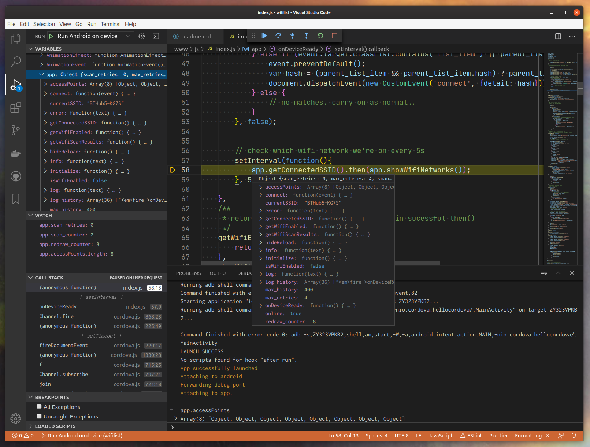

# Scan local wifi networks

# Install this cordova application
> If you're system doesn't have all the below requirements installed<br> follow this guide - [Cordova install instructions](https://github.com/TrystanLea/cordova/blob/master/installation.md)

# Quick Install
1. Clone this repo
    - `$ git clone git@github.com:TrystanLea/cordova.git ~/github/cordova`
1. Open terminal in repo directory
    - `$ cd ~/github/cordova`
1. Install android platform and plugin
    - `$ cordova platform add android`
    - `$ cordova plugin add https://github.com/tripflex/wifiwizard2`

# Test on Android device
1. Put android phone into developer mode
    - > "..To enable developer options, tap the Build Number option 7 times.<br>
      You can find this option in `Settings`->`About Phone` ..."<br>
      > -- <cite>[Official Docs...][1]</cite>
1. Connect phone via usb
1. Open terminal in repo directory
    - `$ cd ~/github/cordova/WifiList`
1. Build project with cordova and send to Android device
    - `$ cordova run android --device`
1. Device should open app for you to interact with (see screenshot above)
1. DONE
> Re-run build step when code changes to see latest build on device

---

# System Requirements:
Git, Node, Java, Android Studio, Gradle & Cordova

- [Node JS][3]
    - `$ node -v`
    ```
    v13.12.0
    ```
- [JAVA][4]
    - `$ java -version`
    ```
    openjdk version "1.8.0_242"
    OpenJDK Runtime Environment (build 1.8.0_242-8u242-b08-0ubuntu3~19.10-b08)
    OpenJDK 64-Bit Server VM (build 25.242-b08, mixed mode)
    ```
- [Android Studio][5]
    - 
- [Gradle][6]
    - `$ gradle --verson`
    ```
    ------------------------------------------------------------
    Gradle 6.3
    ------------------------------------------------------------

    Build time:   2020-03-24 19:52:07 UTC
    Revision:     bacd40b727b0130eeac8855ae3f9fd9a0b207c60

    Kotlin:       1.3.70
    Groovy:       2.5.10
    Ant:          Apache Ant(TM) version 1.10.7 compiled on September 1 2019
    JVM:          1.8.0_242 (Private Build 25.242-b08)
    OS:           Linux 5.3.0-45-generic amd64
    ```

- [Cordova][7]
    - `$ cordova --version`
    ```
    9.0.0 (cordova-lib@9.0.1)
    ```
---

# Using [vscode][2]
You can edit the code and preview changes from within [vscode][2]. You can also see the debug console, watch variables and set breakpoints from within vscode.
Add the Cordova Extention to enable you to integrate the `Run` feature of vscode with your project.
- Open Extentions Tab
  - Search for ["Cordova Tools"][8] in the Extentions tab and install
- Create a launch profile: `Run` -> `Add Configuration` -> `Run on Android`
  - mine looks like this:-
  ```json
        {
            "name": "Run Android on Device",
            "type": "cordova",
            "request": "launch",
            "platform": "android",
            "target": "device",
            "sourceMaps": true,
            "cwd": "${workspaceFolder}"
        }
  ```
  - Select new profile from toolbar dropdown
  - Click `Start Debugging / F5` to preview on Android Device

Once code is running within vscode you can now use these features:-
- Debug Console to see the console output and interact with the javascript 
- Set and walk through breakpoints to debug errors
- Pause execution of application to inspect current state and any variables
- Watch expressions for variable changes
- See the local scope for all variable values
- Hover over the code to see the values set for each variable

## Debugging in vs code while app running on connected Android device:



---

[1]: <https://developer.android.com/studio/debug/dev-options/> "Android Studio Developer Guide"
[2]: <https://code.visualstudio.com/> "Microsoft Virtual Studio Code"
[3]: <https://nodejs.org/> "Node.js"
[4]: <https://openjdk.java.net/> "OpenJDK"
[5]: <https://developer.android.com/studio/> "Android Studio Developer"
[6]: <https://gradle.org/> "Gradle Build tool"
[7]: <https://cordova.apache.org/> "Apache Cordova"
[8]: <https://github.com/Microsoft/vscode-cordova> "Official vscode Cordova Extention"
